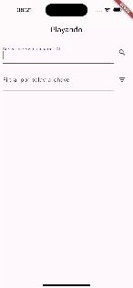

# Documentação do Aplicativo Playando

## Arquitetura: MVVM
Adotando a arquitetura Model-View-ViewModel (MVVM), o Playando promove uma clara separação de responsabilidades, facilitando tanto a manutenção quanto a testabilidade do código. Esta arquitetura é composta por:

- **Model**: Define os dados e a lógica de negócios. No Playando, isso inclui a estruturação dos dados de vídeo e a interação com APIs externas, como o YouTube.
  
  ```dart
  class VideoModel {
    final String id;
    final String title;
    final String channel;
    final String thumbnailUrl;

    VideoModel({this.id, this.title, this.channel, this.thumbnailUrl});
  }
  ```

- **View**: Interface com a qual o usuário interage. No Playando, as views são construídas utilizando widgets Flutter, seguindo as diretrizes de Material Design para uma experiência de usuário coesa e familiar.
  
  ```dart
  class HomeScreen extends StatelessWidget {
    @override
    Widget build(BuildContext context) {
      // Estrutura básica de uma View no Flutter
      return Scaffold(
        appBar: AppBar(title: Text('Playando')),
        body: VideoListView(),
      );
    }
  }
  ```

- **ViewModel**: Camada intermediária que gerencia a lógica de apresentação, conectando o Model à View. O ViewModel reage às ações do usuário e atualiza a View de forma reativa.
  
  ```dart
  class VideoListViewModel with ChangeNotifier {
    List<VideoModel> _videos = [];

    List<VideoModel> get videos => _videos;

    void addVideo(VideoModel video) {
      _videos.add(video);
      notifyListeners();
    }
  }
  ```

## Design e Acessibilidade
O design do aplicativo foi atualizado para aderir ao Material Design, seguindo as diretrizes do Google para garantir uma experiência de usuário consistente e intuitiva. A acessibilidade também foi uma prioridade, com a implementação de recursos como descrições semânticas e contrastes adequados para garantir que o aplicativo seja utilizável por todos.

## Testes
Para assegurar a qualidade e a robustez do aplicativo, foram implementados testes unitários e de widgets, utilizando o `flutter_test`:

- **Testes Unitários**: Focam na lógica de negócios e de apresentação nos ViewModels.
  
- **Testes de Widget**: Avaliam a interface do usuário e as interações dentro das Views.

```dart
testWidgets('Display video list', (WidgetTester tester) async {
  // Teste de widget para verificar a lista de vídeos
  await tester.pumpWidget(MyApp());

  // Verifica se a lista de vídeos é exibida corretamente
  expect(find.byType(VideoListView), findsOneWidget);
});
```

## Bibliotecas Utilizadas
- **Provider**: Para gerenciamento de estado e injeção de dependência.
- **http**: Para comunicação com APIs externas.
- **flutter_test** e **mockito**: Para testes unitários e de widgets.

## Teste o Aplicativo
Experimente o aplicativo Playando via TestFlight e contribua com seu feedback para melhorias futuras:

[**Baixe no TestFlight**](https://testflight.apple.com/join/yYsY4phJ)

## DEMO



